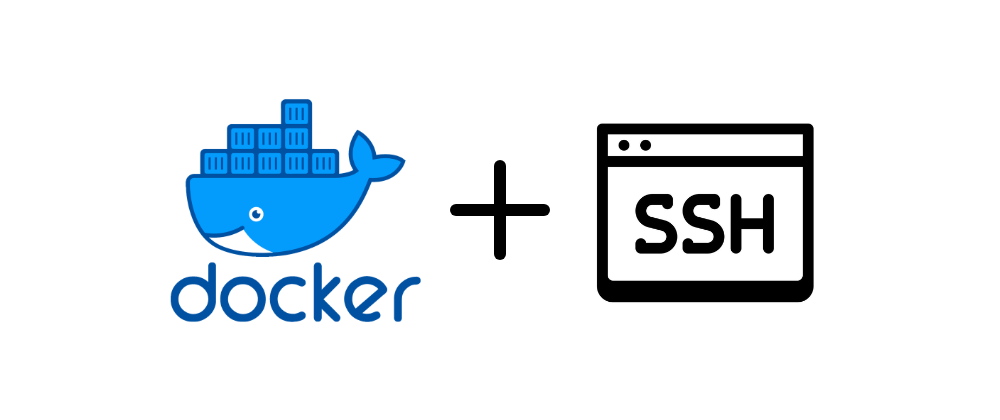

# OpenSSH-Server Docker Container



A containerized OpenSSH server for **secure, temporary LAN file transfers** - without installing SSH on your host machine and without exposing shell access to your host OS.

---

## Quick Start

Run interactively to view host keys on first boot:

### Alpine:
```sh
docker run -it --rm \
    --name USERNAME-openssh-server \
    -v /tmp/USERNAME-share:/home/USERNAME \
    -p 0.0.0.0:2222:22 \
    -e SSH_USER=USERNAME \
    -e SSH_PASSWORD=PASSWORD \
    -e SSH_PUBLIC_KEY="ssh-ed25519 pub-key comment" \
    shobanchiddarth/openssh-server:alpine-1.0.3 /bin/sh
```

### Debian:
```sh
docker run -it --rm \
    --name USERNAME-openssh-server \
    -v /tmp/USERNAME-share:/home/USERNAME \
    -p 0.0.0.0:2222:22 \
    -e SSH_USER=USERNAME \
    -e SSH_PASSWORD=PASSWORD \
    -e SSH_PUBLIC_KEY="ssh-ed25519 pub-key comment" \
    shobanchiddarth/openssh-server:debian-trixie-1.0.0 /bin/bash
```

Passing a shell (`/bin/sh` or `/bin/bash`) starts sshd in the background and drops you into a shell inside the container. Without a shell argument, sshd runs in the foreground as PID 1 - use this for detached (`-d`) deployments.

---

## Why This Exists

The common scenario: you need to quickly share files with another machine on your LAN over a secure channel. Your options feel bad:

- **Install `openssh-server` on bare metal** - SSH is now permanently running on your host, expanding its attack surface.
- **Use an unencrypted method** (HTTP, FTP, netcat) - works, but traffic is cleartext.
- **Give someone SSH access** - now they have a shell into your real machine.

This project solves all three problems. It runs OpenSSH inside a Docker container that maps only a specific host directory into the container. The SSH user lands in that directory and has no visibility into your host filesystem or OS. When you're done, stop and remove the container - SSH is completely gone.

---

## How It Works

- The container runs `openssh-server` inside an isolated environment.
- A dedicated low-privilege user is created inside the container at startup.
- That user's home directory is bind-mounted to a folder on your host - the only path they can ever see.
- Shell access is scoped entirely to the container; no access to host processes or files.
- Authentication supports both password and public key, configured via environment variables.
- The container exposes port `2222` on your LAN interface.

---

## Available Images

| Tag | Base | Shell |
|---|---|---|
| `alpine-1.0.3` | `alpine:3.23.3` | `/bin/sh` |
| `debian-trixie-1.0.0` | `debian:trixie` | `/bin/bash` |

---

## Requirements

- Docker
- Linux (tested on Linux server and client)

---

## Setup

### 1. Pull the image

```bash
# Alpine (smaller image)
docker pull shobanchiddarth/openssh-server:alpine-1.0.3

# Debian Trixie
docker pull shobanchiddarth/openssh-server:debian-trixie-1.0.0
```

### 2. Configure environment

```bash
cp sample.env .env
```

Edit `.env` and fill in the variables. See [`sample.env`](./sample.env) for reference.

### 3. Create the shared directory

```bash
mkdir -p /tmp/USERNAME-share
```

### 4. Run the container

```bash
docker run -d \
  --name USERNAME-openssh-server \
  -p 0.0.0.0:2222:22 \
  --env-file .env \
  -v /tmp/USERNAME-share:/home/USERNAME \
  shobanchiddarth/openssh-server:alpine-1.0.3   # or :debian-trixie-1.0.0
```

**Volume mapping explained:**
- Left side (`/tmp/USERNAME-share`) - the directory on your **host machine** that you want to share. Only files inside this folder are accessible over SSH.
- Right side (`/home/USERNAME`) - the home directory of the SSH user **inside the container**. Adjust the username portion to match the `SSH_USER` you set in `.env`.

---

## Transferring Files

From the **client machine**, use `scp` or `sftp`:

```bash
# Copy a file to the shared folder
scp -P 2222 /path/to/local/file.txt USERNAME@<server-ip>:~/

# Copy a file from the shared folder
scp -P 2222 USERNAME@<server-ip>:~/file.txt /path/to/destination/

# Interactive file transfer session
sftp -P 2222 USERNAME@<server-ip>
```

Replace `USERNAME` with the value of `SSH_USER` in your `.env` and `<server-ip>` with the LAN IP of the machine running the container.

---

## Stopping and Cleanup

```bash
docker stop USERNAME-openssh-server
docker rm USERNAME-openssh-server
```

SSH is now completely gone from the host. No lingering service, no open port.

---

## Security Properties

| Property | Behavior |
|---|---|
| Host OS filesystem | Inaccessible - container sees only the bind-mounted folder |
| Shell access | Scoped to the container; no access to host processes or files |
| Transport | Encrypted via SSH |
| Authentication | Password + public key (both active) |
| Persistence | Zero - stop the container and the attack surface disappears |
| Host SSH daemon | Never installed or started |

> **LAN use only.** Do not expose port `2222` to the internet. The `0.0.0.0` binding makes this accessible on all local interfaces. If you want to restrict it to a specific interface, replace `0.0.0.0` with your LAN IP (e.g., `192.168.1.x:2222:22`).
